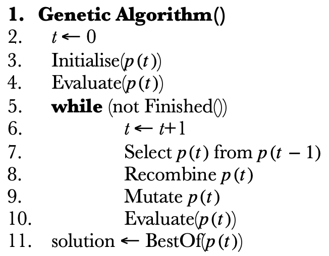
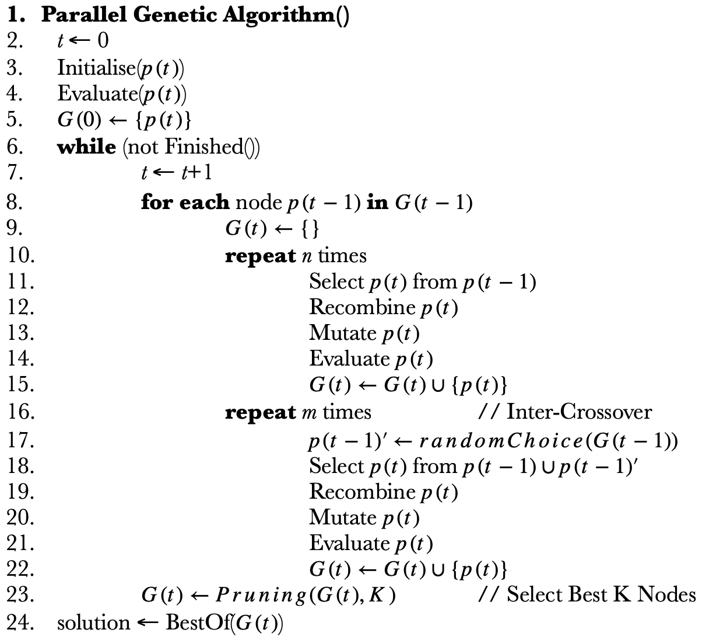
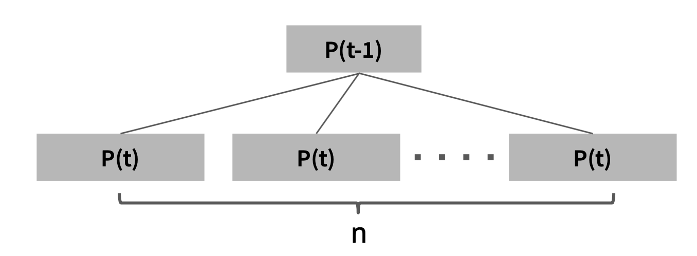
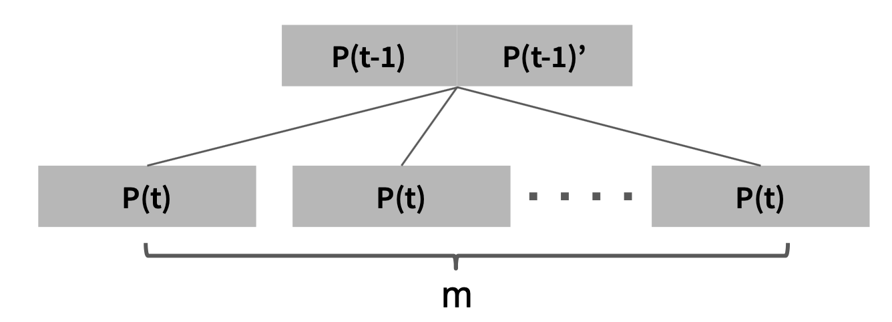
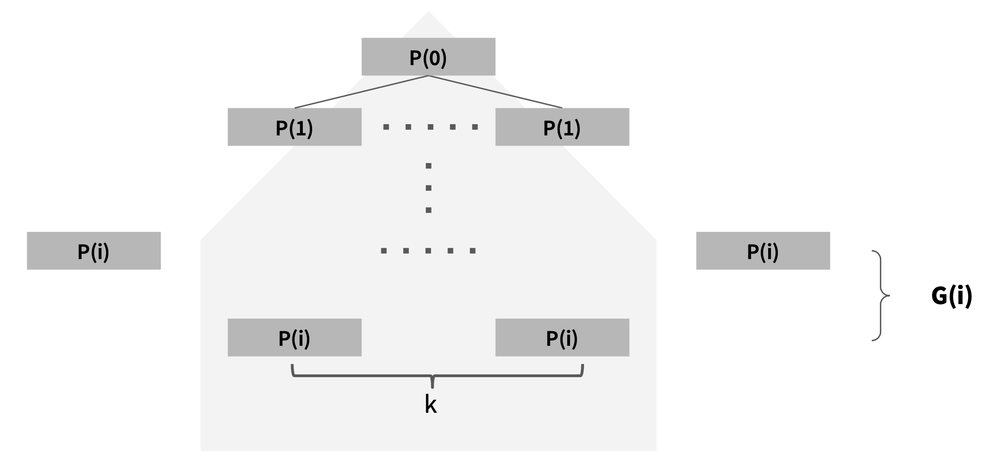

# Test Data Generation Using Parallel Genetic Algorithm

KAIST 2020 Fall CS454 Artificial Intelligence Based Software Engineering

Authorized [Jongchan Park](https://github.com/KAIST-JongchanPark)

Authorized [Jungyeon Jeon](https://github.com/Minguinho99)

Authorized [Donghwan Kim](https://github.com/DonghwanKIM0101)

Authorized [Seungil Lee](https://github.com/ChoiIseungil)

-----------

## Introduction
Generating testdata is necessary for debugging, but test data generation is time-consuming and annoying process. We tried to generate test data automatically using parallel genetic algorithm.

Test Data Generation Using Parallel Genetic Algorithm(report link)

## Genetic algorithm and Parallel Genetice Algorithm

Genetic Algorithm (GA) is a search heuristic that is inspired by Charles Darwin’s theory of natural evolution. 

</img>

GA can explore larger search region thanks to crossover and mutation. Nevertheless, GA has some disadvantages alike other search-based algorithms: it has a tendency to converge to local optima.

To overcome the weakness, we introduce new variant of genetica algorithm, which we named parallel genetic algorithm (PGA). It has a tree-like architecture.

</img>

This is pseudocode of PGA.

</img>

Line 10 to 15 : perform GA parallel n times.

</img>

Line 16 to 22 : perform inter-crossover, so each population can share information with others.

</img>

For memory and calcuation time, we limit the max number of populations in one generation as k. Pruning pick best k populations among one generation.

## Evaluator

# Usage

1. Generate instance of evaluator

        evaluator = Tester.instance()

2. Condition initialize

        evaluator.reset(argnum, max_value, condition_range, error_rate, correction_range)
        
  There are 5 arguments to control error conditions. You can see the detail explanation in [code](https://github.com/ChoiIseungil/CS454Project/blob/main/tester.py#L19).

3. Run experiment

        evaluator.run(input)

## Results

For experiment, we use evaluator from [genetic_CIT](https://github.com/jeong0982/genetic_CIT).  We experiment the performance of PGA compared to GA in terms of population size and time. We run PGA and GA until 80,000 population size, and 400 seconds. We execute 5 times and show the average for experiments about population size, and one time for experiments about time. Also, experiment evaluator without correction range and evaluator with a correction range; error region 0 to 3 in 70% for parameter 0 to 2, error region 3 to 6 in 70% for parameter 0 to 2, and error region 6 to 9 in 70% for parameter 0 to 2.

Result graph ..

# Usage

We implement both GA and PGA to compare the performance.

* Clone this repository:

        git clone https://github.com/ChoiIseungil/CS454Project.git
        cd CS454Project

* Experiment environments:

[correction range for evaluator](https://github.com/ChoiIseungil/CS454Project/blob/main/main.py#L54)

[Quit option for GA](https://github.com/ChoiIseungil/CS454Project/blob/main/GA.py#L71)

[save performance with population size](https://github.com/ChoiIseungil/CS454Project/blob/main/GA.py#L82) or [with time](https://github.com/ChoiIseungil/CS454Project/blob/main/GA.py#L83) in GA

[Quit option for PGA](https://github.com/ChoiIseungil/CS454Project/blob/main/PGA.py#L46)

[save performance with population size](https://github.com/ChoiIseungil/CS454Project/blob/main/PGA.py#L67) or [with time](https://github.com/ChoiIseungil/CS454Project/blob/main/PGA.py#L68) in PGA

* Hyper parameters

[n, m, k in PGA](https://github.com/ChoiIseungil/CS454Project/blob/main/main.py#L57)

        python main.py -p True -m 0.1 -n 3 -l 100 -c 15 -r 0.5

arguments when running program

* -p: "True" for PGA and "False" for GA (default = "False")

* -m: mutation rate (default = 0.05)

* -n: arg_num for evaluator (default = 5)

* -l: max_value for evaluator (default = 20)

* -c: condition_range for evaluator (default = 5)

* -r: error_rate for evaluator (default = 0.3)

## References
* [genetic_CIT](https://github.com/jeong0982/genetic_CIT)

